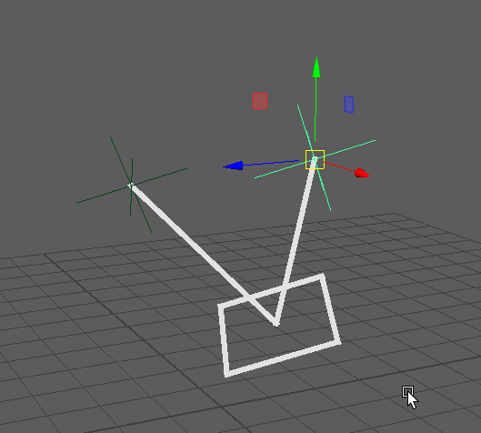

# reflectionLocatorNode
---

## information
 reflectionLocatorNode using maya.api.OpenMaya and viewport 2.0

This is a MPxLocator plugin using the Maya's Viewport 2.0.

This node showcases these available attributes:

* locatorShape (rect, locator, circle)
* lineWidth
* planeColor
* scale

## math

```
R = 2(N * L) * N - L

normal = OpenMaya.MVector(0.0, 1.0, 0.0)
normal *= plane_matrix
normal.normalize()

# calculate the original vector
orig_vector = OpenMaya.MVector(input_point - plane_pos)

# get opposing vector through double cross product
opposing_vector = normal * (2 * (normal * orig_vector))
opposing_vector -= orig_vector

# now multiply it by the scalar value
opposing_vector *= scale

# calculate the reflected point position
vector = plane_pos + opposing_vector
```

## MEL setup
```
loadPlugin reflectionLocator1.py;
createNode reflectionLocator;
createNode locator;
createNode locator;
setAttr locator1.translate -type "double3" 1.0 1.0 0.0;
connectAttr -f locator1.translate reflectionLocator1.input;
connectAttr -f reflectionLocator1.output locator2.t;
parent locator1 locator2 reflectionLocator1;

```

## Resources used in finishing this plugin
ChadVernon, (CGCircuit) reflectionLocator C++ code

Dilen Shah, (Viewport Code Template) https://dilenshah3d.wordpress.com/

## Demo

